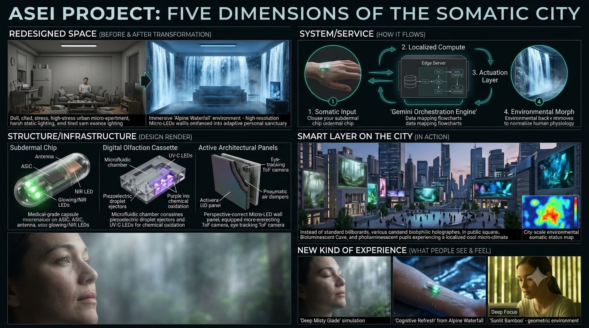

# ASEI: Adaptive Somato-Environmental Interface 🌿

 

*Click the concept art above to watch the full cinematic `concept_video.mp4`.*

ASEI transforms physical architecture into a "Living Somatic Sanctuary". By reading autonomic nervous system metrics via everyday touchpoints (like a smart mug) or subdermal telemetry, ASEI dynamically morphs a room's visuals, acoustics, microclimate, and digital olfaction to passively restore human physiological homeostasis.

Built during the **Top 50 Build in Public** hackathon, this repository contains the V1.0 "Digital Twin" MVP and the technical scaffolding for the V3.0 Active Implantable Medical Device (AIMD) architecture.

## 🧠 Core Architecture
The system operates as a closed-loop cybernetic biofeedback network:
1. **Trigger:** User interacts with a capacitive object (e.g., smart mug) or NFC field.
2. **Sensing:** Edge hardware reads Heart Rate Variability (HRV) and Electrodermal Activity (EDA).
3. **Logic Broker:** A local AI engine maps the biometric vector to Russell's Circumplex Model of Affect (Valence vs. Arousal) and prompts the **Gemini 1.5 Flash API** for real-time actuation parameters.
4. **Spatial Actuation:** The physical room shifts state (e.g., to a "Deep Misty Glade" or "Alpine Waterfall") to intercept cognitive burnout or panic.

## 📂 Repository Structure
*   [`/software`](software/): The V1.0 MVP serverless Edge Broker dashboard (HTML/JS/Web Serial API) bridging the hardware proxy to the Gemini API.
*   [`/firmware`](firmware/): C++ scripts for the ESP32/Arduino hardware proxy, plus the theoretical subdermal implant scaffolding.
*   [`/actuation`](actuation/): Python relay controllers and TouchDesigner/OSC hooks for spatial room morphing.
*   [`/hardware`](hardware/): Schematics for the V1.0 mug proxy and the V3.0 Subdermal BOM (ADPD4100, AD5940, ST25DV04K).
*   [`/docs`](docs/): Deep-dive documentation on affective computing math, the 5-state actuation matrix, sub-second olfaction purging, and telemetry cryptography.
*   [`/assets`](assets/): Contains the core `concept_art` and `concept_video` assets demonstrating the environmental transitions.

## 🚀 Quick Start (MVP Dashboard)
1. Navigate to `/software/ASEI_Dashboard.html` in a Chromium-based browser.
2. Enter your Gemini API key in the configuration block.
3. Connect your Arduino (loaded with `Smart_Mug_Proxy.ino`) via USB.
4. Click "Connect Hardware" and swipe the physical trigger to simulate the cybernetic loop.

## 🛡️ Privacy & Safety
ASEI strictly adheres to zero-knowledge telemetry. Raw bio-waveforms are processed on the edge, reduced to scalars, and transmitted via ECDH-256 ephemeral handshakes. Cloud APIs (Gemini) are used strictly for ephemeral environmental inference, storing no personal biological signatures.
